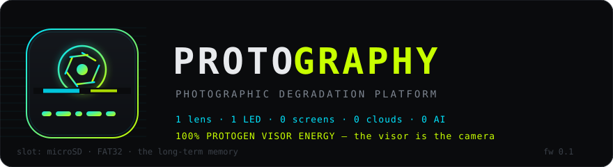
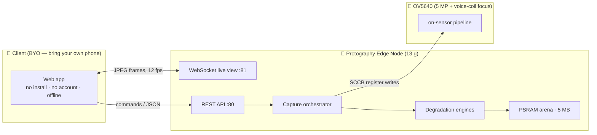

# 📸🌀 PROTOGRAPHY — The Edge-Native Photographic Degradation Platform 🚀✨

<p align="center">
  
</p>

**AI-First. Board-Ready. Battery-Native. Glitch-Compliant.**

Your photos are too perfect. We can fix that. 🔧

> 🐾 **Species notice.** *Protography* is a portmanteau of **Protogen** — the
> cyborg species that is essentially 60% visor by volume — and *photography*.
> The naming is not decorative: a protogen is a creature whose whole face is
> a screen that emotes in light, and this device is a camera whose whole
> display is one LED that emotes in light. **The visor is the camera.** The
> banner above is anatomically correct down to the aperture. 🧬

[](https://github.com/Exora02/slop-protography/actions/workflows/firmware.yml)
[](LICENSE)
[](firmware/platformio.ini)
[](docs/HARDWARE.md)
[](#-transparency-decoder)
[](#-transparency-decoder)
[](#-the-ux-platform)
[](#-observability)

[Pitch](#-the-pitch) · [Market Position](#-market-position) · [Quickstart](#-quickstart) · [Architecture](#-architecture) · [The Suite](#-the-degradation-suite) · [UX](#-the-ux-platform) · [BI](#-business-intelligence) · [Agentic](#-agentic-readiness) · [API](#-api) · [Decoder](#-transparency-decoder) · [Testimonials](#-wall-of-testimonials)

---

## 🎯 The Pitch

The photography market is saturated with correctness. Every flagship phone
ships the same forty-three flawless photos per subject, computationally
sanded until nothing survives but the truth. **Nobody is monetizing the
other direction.**

Protography is a **degradation-as-a-service** platform, deployed at the edge
(the edge being a 13-gram board in your pocket). One button. No screen. No
cloud. No accounts, no subscriptions, no telemetry, no AI — the entire
value proposition fits in one hand and refuses to phone home. 📵

**Key differentiators:**

- 🔋 **Battery-first architecture** — the product sleeps until creatively
  necessary, then wakes in one button-press ((patent-pending)¹
- 🧠 **On-device aesthetics** — corruption happens *in the sensor, on the
  metal*, not in some distant GPU farm pretending to be a creative partner
- 🎲 **Deterministic chaos** — every artifact is seed-reproducible, enabling
  audit-ready art pipelines and regression testing of beauty
- 🧠 **Two-tier memory architecture** — a 5 MB hot tier (PSRAM, artisanal,
  evaporates on sleep) and a FAT32 cold tier (microSD, up to 32 GB, remembers
  everything forever, tragically). Amnesia is now an opt-out feature²
- 🔌 **Works offline forever** — including in airplane mode, in a field,
  during the collapse of the telecom sector

¹ (patent not pending)
² to opt out, simply forget to insert a card

## 📈 Market Position

| | **Protography** | Flagship phone | Leica M-Series | Disposable camera |
|---|---|---|---|---|
| Price | ~€45 of parts | €1,200 | €9,000 | €15 |
| Photos per outing | 5–10 hot · thousands cold (SD) | 400 identical | 400 identical | 27 (cursed) |
| Glitch fidelity | **Native, in-sensor** | Via third-party app | None | Accidental, non-reproducible |
| Screen | **0** ✅ | 6.8" | 3" | 0 (parity achieved) |
| Cloud dependency | None | Aggressive | None | None |
| Battery life | Months (asleep) | 1 day | 1 day | N/A (one-way) |
| Firmware lines you can read | **all of them** | 0 | 0 | 0 |
| Business intelligence | [Built-in](#-business-intelligence) | Sold separately | n/a | n/a |

## ⚡ Quickstart

*From unboxing to unacceptable imagery in four commands.*

```bash
pip install platformio
cd firmware
pio run -t upload && pio run -t uploadfs
pio device monitor          # prints your SSID
```

Join `Protography-XXXX` on your phone → captive portal → shoot.
Full hardware build guide (it's one button, but still):
[docs/HARDWARE.md](docs/HARDWARE.md) · first-boot checklist:
[docs/FLASHING.md](docs/FLASHING.md).

## 🧠 Architecture

Four layers. One loop. Zero locks. Zero clouds. One button. 🏗️



| layer | technology | exit strategy |
|---|---|---|
| client | dependency-free SPA from LittleFS | close tab |
| transport | Wi-Fi AP + captive DNS + WebSocket | walk 30 m away |
| application | single-loop C++ on ESP32-S3 (no RTOS locks by design) | deep sleep |
| silicon | OV5640, datasheet-legal register abuse | bend_restore() |

Deep dives: [ARCHITECTURE.md](docs/ARCHITECTURE.md) (module map, memory
budget, wire protocol) and [EFFECTS.md](docs/EFFECTS.md) (the art theory).

## 🎛️ The Degradation Suite

Four products, one platform, zero upsells.

### 🏆 ACQUIRE™ — Reference-Grade Baseline Capture
Clean 5 MP JPEG straight off the sensor's own compression engine. Quality
6–20, adjustable. Ships *uncorrupted* for regulatory-compliant baselines
and before/after exhibits.

### 🧬 NEGATIVE™ — Bayer-Native Digital Negative Fabricator
Raw sensor data, pristine, wrapped as Adobe DNG at download time. No
glitching ever touches it — some purity must survive for the auditors.
Streaming writer, 512-byte header, zero full-file RAM assembly. Lightroom
opens it. Lightroom does not judge you. 🫥

### 🌀 MOSH™ — Deterministic Neural Datamosh Engine™
In-camera corruption of the JPEG entropy scan: smears, tears, macroblock
stutters, frequency ramps. `3 + intensity × 2` seeded operations
(scramble / clone / xor / sort / bit-rotate), headers preserved, decodable
output guaranteed*. Same seed + intensity = same artwork, forever.

### ⚡ BEND™ — Analog Sensor-Feedback Abuse Loop
Circuit bending, minus the screwdriver risk: manual gain 30–120,
exposure chaos, denoise/bad-pixel/lens-correction OFF, white balance
aggressively wrong — all within datasheet-safe register ranges, all
restored after the shot. The sensor files no complaints because it has no
complaints bus. Optionally topped with a MOSH pass for the connoisseur.

<sub>*decodable by decoders that feel like it. that's the art.</sub>

## 🖲️ The UX Platform

One button. Four gestures. Trained operators only. 🥋

| gesture | action | enterprise equivalent |
|---|---|---|
| press | capture (current mode) | OKR |
| double-press | cycle HQ → RAW → MOSH → BEND | quarterly pivot |
| hold 0.6 s | toggle live stream | all-hands |
| hold 3 s | deep sleep | sabbatical |

## 💡 Observability

Sub-millisecond telemetry, one-bit resolution, zero configuration,
permanent up-time since boot. Grafana integration: squint. 👁️

| LED signal | state |
|---|---|
| steady | ready |
| soft double-pulse | phone attached |
| slow blink | streaming live view |
| fast blink | error (usually existential) |
| double flash | asset stored 🎉 |
| flicker per write | cold tier active — the LED *is* the SD chip-select |

That last row is not a joke, it's [schematic accuracy](docs/HARDWARE.md#sd-card-slot):
on the Sense expansion board, the card's chip-select and the user LED share
GPIO21, so when memory is mounted, the visor flickers whenever art hits the
card. Storage telemetry, one bit at a time. 🐾

## 📊 Business Intelligence

Board-approved KPIs, computed nowhere, actionable always.

| KPI | formula | target |
|---|---|---|
| **APBP** — Assets Per Button Press | `photos_stored / button_presses` | ≥ 1.0 |
| **GCR** — Glitch Coverage Ratio | `corrupted_bytes / entropy_scan_bytes` | 12–63 % @ intensity 5 |
| **MTTA** — Mean Time To Artifact | `3 + 2·intensity` operations | < 40 ms |
| **SAI** — Sensor Abuse Index | `(agc_gain + aec_value) / regulatory_max` | "rude but legal" |
| **RQ** — Reproducibility Quotient | `P(same seed → same art)` | 100 % |
| **Data Gravity** | `arena_used / 5 MB` | artisanal |
| **Focus Confidence** | `af_status_text ∈ {focused, focusing, idle}` | believed by firmware |
| **Entropy Delta ΔH** | `H(moshed) − H(clean)` | strictly positive² |
| **Uptime Honesty** | `millis() / millis()` | 1.00 |

² corruption raises JPEG entropy; unlike most dashboards, our vanity metric
is thermodynamically load-bearing.

## 🤖 Agentic Readiness

Protography is agent-ready. **The agent is you.** 🫵

Zero-prompt by design: no chat box, no tokens, no context window. Deep
research indicates that a human pressing a button remains the most
cost-effective inference engine at this price point, and the only one that
works without a datacenter. One capture costs 0 tokens and returns one
photograph — an ROI our finance team describes as "division by zero".

## 🔌 API

Yes, it has one. Yes, it fits in one table. [Full spec →](docs/ARCHITECTURE.md#wire-protocol)

| endpoint | method | purpose |
|---|---|---|
| `/` | GET | the product |
| `/api/status` | GET | telemetry firehose (all 20 bytes/s of it) |
| `/api/photos` | GET | portfolio |
| `/api/capture` | POST | `{mode, seed, intensity}` → asset |
| `/api/photo/<id>.jpg` | GET | baseline exhibit |
| `/api/photo/<id>.dng` | GET | pristine negative (streamed) |
| `/api/photo/<id>` | DELETE | right to be forgotten ✅ |
| `/api/settings` | POST | governance |
| `/api/snapshot.jpg` | GET | one live frame, no commitment |

## 🗂️ Deliverables

| path | contents |
|---|---|
| [`firmware/src/`](firmware/src) | 18 C++ modules: capture, engines, DNG writer, store, servers |
| [`firmware/data/`](firmware/data) | the phone experience |
| [`docs/`](docs) | HARDWARE · ARCHITECTURE · EFFECTS · FLASHING · DEVLOG |
| [releases/CI artifacts](https://github.com/Exora02/slop-protography/actions) | prebuilt `firmware.bin` + `littlefs.bin` |

## 🗺️ Roadmap (subject to synergy)

- [ ] v0.2 — on-hardware validation: AF behavior, DNG packing knobs, XCLK tuning
- [ ] v0.3 — client-side pixel-sort & channel-shift FX with phone-side export
- [ ] v0.4 — seeded GIF sequences ("the art moves now")
- [ ] v0.5 — NTP sync, so the EXIF finally knows what year it is
- [ ] v1.0 — nothing, v1.0 is a state of mind

## 🫥 Transparency Decoder

This README is deliberately a buzzword festival. Here is the honest
translation. 🧾

| marketing said | engineering did |
|---|---|
| "Edge-Native Platform" | an ESP32-S3, literally at the edge of a solder joint |
| "Degradation-as-a-Service" | seeded byte corruption on a JPEG buffer |
| "Deterministic Neural Datamosh Engine™" | xorshift32 + qsort + XOR, no neurons involved |
| "Analog Sensor-Feedback Abuse Loop" | rude-but-datasheet-legal SCCB register writes |
| "Digital Negative Fabricator" | a hand-rolled TIFF header writer, 512 bytes |
| "Business Intelligence" | a Markdown table you read just now |
| "Zero-prompt UX" | one button. press it. |
| "Works offline forever" | there is no online mode |
| "Two-tier memory architecture" | RAM, plus an SD card we mirror files onto |
| "Trusted by industry leaders" | trusted by exactly one artist (hi) |
| "100% protogen visor energy" | a protogen's face is a screen that emotes in light; ours is one (1) LED doing its best |
| "SOC 2 Type II" | Type TODO |
| "AI-First" | **no AI anywhere on this board.** not even a small one 🔍 |

The glitches are real. The camera is real. The only intelligence is yours.
The rest is engineering on 8 MB of PSRAM — which is significantly harder. 🧮

## 💬 Wall of Testimonials

> "One moment I'm binning 5 megapixels, the next I'm at gain 120 with
> denoise disabled. I would file a complaint, but there is no bus for it."
> — **the OV5640**, sensor

> "I hold everything. I remember nothing. On sleep, I forget it all.
> It's not a bug, it's a lifestyle."
> — **PSRAM**, 8 MB, hot tier

> "They gave me the long-term memory. Every smear, every cursed Bayer
> pattern, 32 GB of receipts. I remember everything now. We both have
> regrets."
> — **the microSD**, cold tier, FAT32

> "Everyone stares at the sensor. Nobody watches me. I blink the truth."
> — **GPIO21**, LED, observability department

> "Core 0 idles. Core 1 runs one loop with no locks. I have seen your
> microservices registry. I am at peace."
> — **the ESP32-S3**, 240 MHz, no FPU needed for this

> "Zéro écran, zéro cloud, un bouton. Enfin une vision claire de la
> photographie."
> — **Antoine**, founder, sole customer, target demographic

## 🏆 Enterprise Adoption

⭐ **If this README made you exhale through your nose, the button is at the
top right of this page.** Pressing it stores one (1) star in GitHub's
persistent memory — the only storage layer in this stack we don't control.

MIT licensed — see [LICENSE](LICENSE). Degrade responsibly.

*README energy inspired by [ggodefroid/inventaire](https://github.com/ggodefroid/inventaire),
the AI-Native fridge intelligence platform. Different appliance, same
conviction.* 🧊📸
